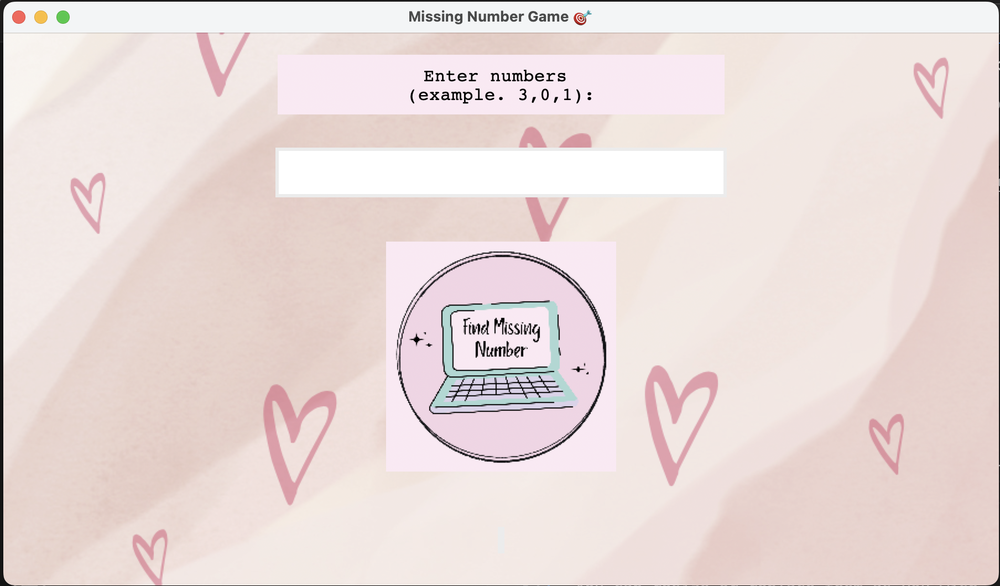
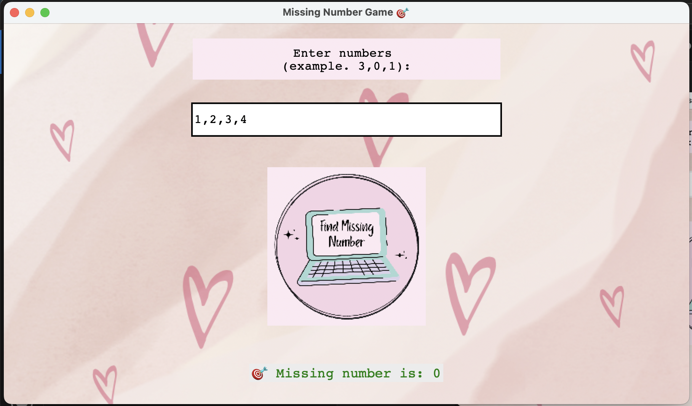
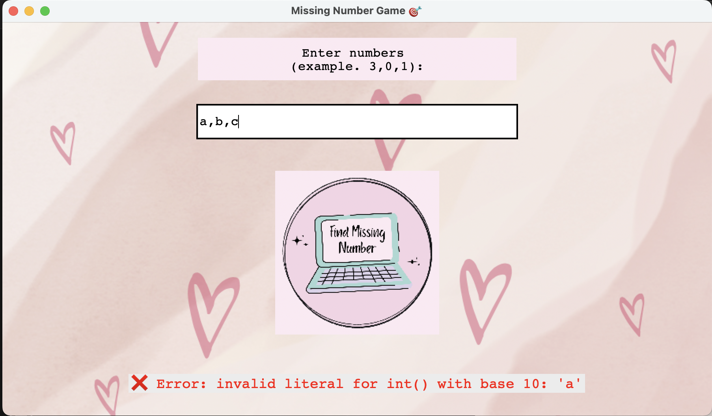

# 🎯 Missing Number Game (GUI Version)

A playful and educational GUI app built with Python and Tkinter to help users find the missing number from a sequence of integers ranging from `0` to `n`, with exactly **one missing** number.

---

## 🖼️ Preview





---

## 📦 Features

- ✏️ Enter numbers like `3,0,1`
- 🚫 Detects and warns about:
  - Duplicate numbers
  - Numbers outside valid range `[0...n]`
  - Invalid input format
- ✅ Displays the missing number
- 🎨 Includes custom background, button, and label images

---

## 🛠️ Tech Stack

- **Language**: Python 3
- **GUI Toolkit**: Tkinter (built-in with Python)

---

## 🚀 How to Run

1. Clone or download this repo:
   ```bash
   git clone https://github.com/your-username/MissingNumberGameApp.git
   cd MissingNumberGameApp

2. Make sure you have Python 3 installed:
    python --version

3. Run the app:
    python missingNumberGameGUI.py

---

## 🖼️ Required Assets

Make sure these image files are in the same folder as your script:

    ~ bgheart.png – background image
    ~ label.png – background for input label
    ~ button.png – custom image button
    ~ image.png - preview for readme file
    ~ image-1.png - preview for readme file
    ~ image-2.png - preview for readme file
You can resize or replace them as you wish.

---

## ✨ Example

✅ Valid Input:
3, 0, 1
Output: 🎯 Missing number is: 2

❌ Invalid Input:
3,3,1
Output: ❌ Error: Input contains duplicates.

---

## 📁 Folder Structure

MissingNumberGameApp/  
│  
├── missingNumberGameGUI.py     -   Main application script  
├── bgheart.png                 -   Background image  
├── label.png                   -   Label background image  
├── button.png                  -   Custom button image  
├── image.png                   -   Preview in Readme file  
├── image-1.png                 -   Preview in Readme file  
├── image-2.png                 -   Preview in Readme file  
└── README.md                   -   This file

---

## 👩‍💻 Author
Gigi Nwe (2025)
